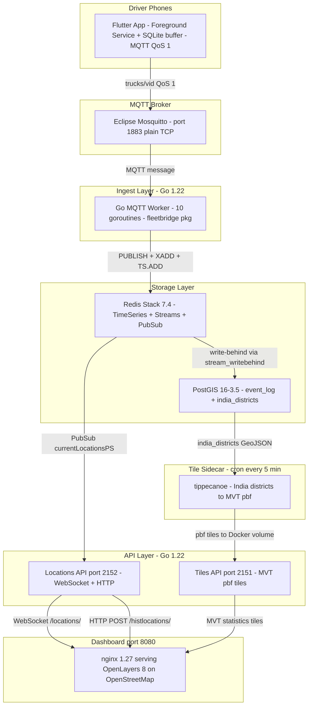

# FleetTrack India — System Design & Architecture

## 1. Project Overview

A **production-grade Indian fleet & truck tracking platform** built on a stream-processing backbone:

```
Flutter Driver App → Mosquitto MQTT → Go Worker → Redis Stack → WebSocket → OpenStreetMap Dashboard
```

GPS telemetry from driver phones is ingested via MQTT, fanned out live to a dashboard via Redis Pub/Sub, stored as time-series for trip history, and written behind to PostGIS for spatial analytics and map tile generation.

---

## 2. Architecture Diagram




---

## 3. MQTT Payload Schema

The Flutter app publishes JSON directly to `trucks/{vehicleID}` with compact keys to minimise bytes on 2G/3G networks (~200 bytes per event).

```json
{
  "vid": "AP 30 Y 1828",
  "did": "9505683966",
  "tid": "550e8400-e29b-41d4-a716-446655440000",
  "lat": 17.7137197,
  "lng": 83.1691558,
  "spd": 0.30,
  "brg": 0.0,
  "acc": 5.10,
  "ts":  1778132507,
  "bat": 82,
  "src": "mobile"
}
```

| Field | Go Struct Field | Type | Description |
| ----- | --------------- | ---- | ----------- |
| `vid` | `VehicleID` | `string` | Registration plate |
| `did` | `DriverID` | `string` | Driver phone / employee ID |
| `tid` | `TripID` | `string` | UUID — new per trip session |
| `lat` | `Lat` | `float64` | WGS84 latitude |
| `lng` | `Lng` | `float64` | WGS84 longitude |
| `spd` | `Speed` | `float32` | Speed in km/h |
| `brg` | `Bearing` | `float32` | Heading degrees from north |
| `acc` | `Accuracy` | `float32` | GPS fix accuracy in metres |
| `ts`  | `Timestamp` | `int64` | Unix epoch seconds (UTC) |
| `bat` | `Battery` | `int` | Battery level 0–100 % |
| `src` | `Source` | `string` | `"mobile"` \| `"obd"` \| `"sim"` |

**Go type:** `fleetbridge.TruckEvent` in `hslservices/event.go`

**Trip key:** `MD5(VehicleID + ":" + TripID)` — used as the Redis key prefix for all time-series belonging to one trip.

---

## 4. Services Breakdown

### 4.1 `mosquitto` — MQTT Broker · port **1883**

**Image:** `eclipse-mosquitto:2`  
**Config:** `mosquitto/mosquitto.conf`

- Plain TCP on `1883` for driver phones on the same LAN / Docker network.
- Anonymous access enabled (testing). Production: add `password_file` + TLS on `8883`.
- Persistence enabled at `/mosquitto/data/`.
- Message size limit: 64 KB (truck events are ~200 bytes).

---

### 4.2 `mqtt` — Go MQTT Worker · internal service

**Image:** `fleet_worker` (built from `hslservices/cmd/mqtt/Dockerfile`)  
**Runtime:** `gcr.io/distroless/static-debian12:nonroot` (~3 MB)

**Startup:**
- Subscribes to `trucks/#` on `mosquitto:1883` via `paho.mqtt v1.5`.
- Spawns **10 concurrent `writeRedis` goroutines**, each draining a shared buffered channel (size 1024).

**Per-event logic in `writeRedis()`:**

```
1. Deserialise MQTT payload → TruckEvent
2. Compute tripKey = MD5(VehicleID:TripID)
3. SADD "tripKeys" tripKey
   └─ If new trip: create TimeSeries pairs (speed + gh)
4. TxPipeline (atomic):
   ├─ PUBLISH currentLocationsPS <raw payload>
   ├─ XADD events * vid did tid key lat lng spd brg acc ts bat src
   ├─ TS.ADD positions:<tripKey>:speed * <spd>  RETENTION 60000
   └─ TS.ADD positions:<tripKey>:gh    * <gh64> RETENTION 60000
```

| Redis Command | Purpose |
| ------------- | ------- |
| `PUBLISH currentLocationsPS` | Fan-out to all live WebSocket dashboard clients |
| `XADD events` | Write-behind stream → PostGIS via `stream_writebehind.py` |
| `TS.ADD …:speed` | Speed time-series (60 s rolling window) |
| `TS.ADD …:gh` | Position as 64-bit geohash integer (60 s rolling) |

**Time-series creation (`createTimeSeriesPair`):**

- Creates a raw series and a `15 s LAST` aggregation (`TS.CREATERULE`) with a 2-hour retention.
- Labelled `trip=<tripKey>` to enable `TS.MRANGE … FILTER trip=<key>`.

---

### 4.3 `redis` — Redis Stack 7.4 · port **6379**

**Image:** `redis/redis-stack-server:7.4.0-v3` (official)  
**Modules included:** TimeSeries, Streams, Pub/Sub, JSON, Search, Bloom

**Key layout:**

| Key Pattern | Type | TTL / Retention | Purpose |
| ----------- | ---- | --------------- | ------- |
| `tripKeys` | Set | — | Dedup known trip IDs (prevents duplicate TS.CREATE) |
| `currentLocationsPS` | Pub/Sub channel | — | Fan-out live positions to dashboard |
| `events` | Stream (XADD) | — | Write-behind buffer to PostGIS |
| `positions:<tripKey>:speed` | TimeSeries | 60 s | Raw speed per trip |
| `positions:<tripKey>:speed:agg` | TimeSeries | 2 hr | 15 s LAST aggregation |
| `positions:<tripKey>:gh` | TimeSeries | 60 s | Raw geohash per trip |
| `positions:<tripKey>:gh:agg` | TimeSeries | 2 hr | 15 s LAST aggregation |

**Write-behind (`redis/stream_writebehind.py`):**
- Reads from `events` stream in batches of up to 10,000.
- Bulk inserts to `statistics.events` (UUID, JSONB) in PostGIS via `psycopg2` prepared statements.

---

### 4.4 `locations_api` — Locations API · port **2152**

**Image:** built from `hslservices/cmd/locations/Dockerfile`  
**Runtime:** `gcr.io/distroless/static-debian12:nonroot`

#### Endpoints

| Method | Path | Protocol | Description |
| ------ | ---- | -------- | ----------- |
| `GET` | `/health/` | HTTP | Health check — returns `Fleet Tracker India — OK` |
| `GET` | `/locations/` | **WebSocket** | Live positions fan-out |
| `POST` | `/histlocations/` | HTTP | Historical trip query |

**`GET /locations/` (WebSocket)**
- Upgrades HTTP → WebSocket (gorilla/websocket).
- Registers connection in a pool of max 100 (semaphore-guarded, mutex-protected).
- `subscriptionFanout()` goroutine subscribes to `currentLocationsPS` and fans every message to all active WebSocket connections — non-blocking via per-connection buffered channel.
- Dropped connections removed via `unregisterConnections()` goroutine watching a callback channel.

**`POST /histlocations/`**
- Accepts `{ "vid": "...", "tid": "..." }` JSON body.
- Recomputes `tripKey = MD5(vid:tid)`.
- Queries `TS.MRANGE - + FILTER trip=<tripKey>` to fetch both `gh:agg` and `speed:agg` series.
- Decodes 64-bit geohash integers → lat/lng via `mmcloughlin/geohash`.
- Returns up to 240 `TruckEvent` objects as JSON.

---

### 4.5 `tiles_api` — Tile API · port **2151**

**Image:** built from `hslservices/cmd/tiles/Dockerfile`  
**Runtime:** `gcr.io/distroless/static-debian12:nonroot`

Serves pre-generated **Mapbox Vector Tiles (.pbf)** from the shared `tiles` Docker volume.

#### Endpoints

| Method | Path | Description |
| ------ | ---- | ----------- |
| `GET` | `/health/` | Health check — returns `Fleet Tracker India — Tiles OK` |
| `GET` | `/{layer}/{z}/{x}/{y}` | Serve `.pbf` tile (Content-Type: `application/x-protobuf`) |

**Layers:** `statistics` (India district speed aggregations)

---

### 4.6 `tilegen` — Tile Generation Sidecar

**Image:** `osgeo/gdal:alpine-small-3.6.3` + tippecanoe (built from source)  
**Cron:** every 5 minutes (`crontab.txt`)

**Flow:**
1. `REFRESH MATERIALIZED VIEW CONCURRENTLY event_log` in PostGIS.
2. `ogr2ogr` dumps district-level average speed as GeoJSON from `india_districts` (GADM 4.1 boundaries).
3. `tippecanoe` converts GeoJSON → MVT `.pbf` into `/tiles/statistics/` volume.

**One-time seed (`get_static_data.sh`):**
- Downloads GADM 4.1 India state & district shapefiles (free, no API key).
- Loads into PostGIS as `india_states` and `india_districts` via `ogr2ogr`.

---

### 4.7 `postgis` — Persistent Store · port **5433**

**Image:** `postgis/postgis:16-3.5` (official)

**Schema:**

```sql
statistics.events       -- raw truck events: UUID, JSONB payload, timestamp
                        -- written by stream_writebehind.py

event_log               -- materialized view: last 1 hr of events
                        -- geometry POINT (EPSG:4326) with GIST spatial index
                        -- columns: vid, did, tid, lat, lng, spd, brg, acc, ts, geom

india_states            -- GADM 4.1 India state boundaries (ogr2ogr loaded)
india_districts         -- GADM 4.1 India district boundaries (ogr2ogr loaded)
                        -- used by tilegen for choropleth speed layer
```

---

### 4.8 `frontend` — OpenStreetMap Dashboard · port **8080**

**Image:** `nginx:1.27-alpine`  
**No build step** — the dashboard is a single self-contained `index.html` that loads OpenLayers 8 from CDN.

**nginx routes:**

| Path | Proxied to | Description |
| ---- | ---------- | ----------- |
| `/` | static HTML | Dashboard map |
| `/locations/` | `locations_api:2152` | WebSocket upgrade (3600 s timeout) |
| `/histlocations/` | `locations_api:2152` | Trip history REST |
| `/tiles/` | `tiles_api:2151` | MVT district tiles |

**Map features:**
- Live vehicle markers colour-coded by speed (green → amber → red).
- Breadcrumb trail on vehicle click (fetches `/histlocations/`).
- OSM base tiles — no API key required.
- District-level speed choropleth layer (from tilegen).
- Sidebar telemetry feed with flash animations per incoming event.

---

## 5. Data Flow — End-to-End

```
[Flutter App]
  GPS fix → SQLite buffer → MQTT QoS 1 → trucks/{vid}
                                              │
                                       [Mosquitto :1883]
                                              │
                                    [Go MQTT Worker × 10]
                                              │
                         ┌────────────────────┼────────────────────┐
                         ▼                    ▼                    ▼
               PUBLISH currentLocationsPS   XADD events         TS.ADD positions:*
                         │                    │                    │
               [Redis Pub/Sub]       [Redis Stream]      [RedisTimeSeries]
                         │                    │                    │
            [Locations API :2152]   [stream_writebehind.py]   [/histlocations/]
                         │                    │
              [WebSocket clients]        [PostGIS]
                         │                    │
              [Dashboard :8080]        [tilegen cron]
                                             │
                                     [Tiles API :2151]
                                             │
                                     [Dashboard :8080]
```

---

## 6. Environment Configuration

| Env File | Used By | Key Variables |
| -------- | ------- | ------------- |
| `envs/mqtt_connector.env` | `mqtt` worker | `MQTT_TOPIC=trucks/#`, `MQTT_BROKER=mosquitto`, `MQTT_PORT=1883` |
| `envs/redis.env` | `mqtt`, `locations_api` | `REDIS_HOST`, `REDIS_PORT=6379`, `REDIS_DB=0` |
| `envs/postgres.env` | `postgis`, `redis`, `tilegen` | `POSTGRES_DB`, `POSTGRES_USER`, `PGPASSWORD` |
| `envs/layers_api.env` | `tiles_api` | `TILE_DIRECTORY` |
| `envs/hslweb.env` | `frontend` | `API_HOST` |

---

## 7. Docker Compose Services Summary

| Service | Image | Ports | Depends On |
| ------- | ----- | ----- | ---------- |
| `mosquitto` | `eclipse-mosquitto:2` | `1883`, `9001` | — |
| `redis` | `redis/redis-stack-server:7.4.0-v3` | `6379` | — |
| `postgis` | `postgis/postgis:16-3.5` | `5433→5432` | — |
| `mqtt` | `fleet_worker` (distroless) | — | `mosquitto`, `redis` |
| `locations_api` | `locations_api` (distroless) | `2152` | `redis` |
| `tiles_api` | `tiles_api` (distroless) | `2151` | — |
| `tilegen` | `gdal:alpine + tippecanoe` | — | `postgis` |
| `frontend` | `nginx:1.27-alpine` | `8080` | `redis`, `mqtt`, `locations_api` |

---

## 8. Go Module (`hslservices/`)

**Module:** `github.com/dmw2151/fleetbridge`  
**Go version:** `1.22`

| Package | Version | Role |
| ------- | ------- | ---- |
| `redis/go-redis/v9` | `v9.7.3` | Redis Stack client |
| `eclipse/paho.mqtt.golang` | `v1.5.0` | MQTT subscriber |
| `gorilla/mux` | `v1.8.1` | HTTP router |
| `gorilla/websocket` | `v1.5.3` | WebSocket upgrade |
| `mmcloughlin/geohash` | `v0.10.0` | Geohash encode/decode |
| `sirupsen/logrus` | `v1.9.4` | Structured logging |
| `golang.org/x/sync` | `v0.10.0` | Semaphore (WS pool) |

---

## 9. Flutter Driver App

**Package:** `driver_app/`  
**Platform:** Android (Foreground Service — GPS stays alive with screen off)

| Feature | Implementation |
| ------- | -------------- |
| GPS collection | `flutter_foreground_task` v8 — runs in Android Foreground Service |
| Adaptive rate | 5 s moving · 60 s parked (saves ~80 % battery) |
| ±50 m filter | Discards poor-fix / tunnel readings |
| Offline buffer | SQLite queue (`offline_buffer.dart`) — zero data loss |
| MQTT | `mqtt_client` — QoS 1, auto-reconnect, buffer flush on reconnect |
| Auto-boot | Restarts tracking after phone reboot |
| State | `TrackingProvider` (ChangeNotifier) + `TrackingService` (Foreground Task) |

**MQTT topic published:** `trucks/{vehicleID}` — one topic per vehicle registration plate.

---

## 10. Security Roadmap

| Item | Status | Action |
| ---- | ------ | ------ |
| MQTT auth | ❌ Open | Add `password_file` to `mosquitto.conf`, one credential per vehicle |
| MQTT TLS | ❌ HTTP only | Add listener on `8883` with Let's Encrypt cert |
| WebSocket auth | ❌ Open | Add JWT verification in `livelocationsHandler` |
| SOS topic | 🔧 Wired | `trucks/{vid}/sos` → `PUBLISH alerts:sos` → notify fleet manager |
| Geofencing | 📋 Planned | `GEODIST geo:fleet:<fid>` check per event in Go worker |
| PostGIS RLS | 📋 Planned | Row-level security per fleet tenant |
